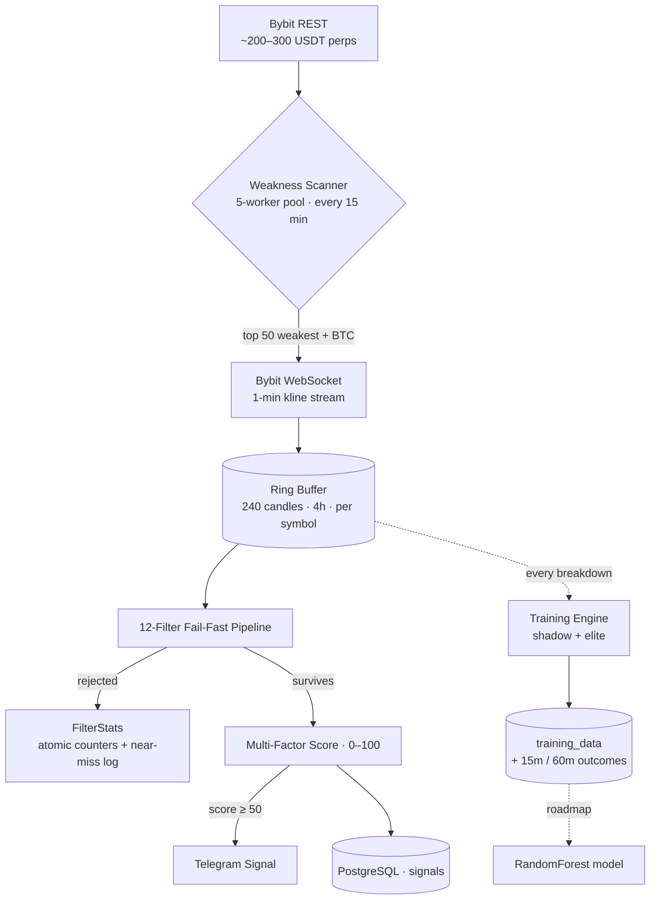

<div align="center">

# ⚡ Quant Bot

**A real-time crypto-futures signal engine that hunts weakness, shorts breakdowns the instant support cracks — and is teaching itself to predict the next one.**


`Go 1.22` · `~6,700 LOC` · `8 packages` · `~200–300 perps scanned` · `1-minute resolution` · `sub-100 ms candle→signal`

</div>

---

Quant Bot continuously scans the **entire Bybit USDT-perpetuals universe**, ranks the assets that are bleeding hardest against Bitcoin, watches them candle-by-candle over a live WebSocket feed, and fires a high-conviction **short signal the moment price breaks support on an anomalous volume spike** — but only after the setup survives a **12-stage gauntlet** purpose-built to reject bear traps, short squeezes, and falling knives.

And here's the part that makes it more than a screener: **every breakdown it ever sees is recorded with its 15- and 60-minute outcome.** That turns a stream of trading signals into a growing, labeled dataset — the foundation for replacing hand-tuned heuristics with a model that learns the edge itself.

> This is the story of a system that started as a rule-based detector, hardened into a risk-aware filter, and is now evolving into a **self-learning prediction engine**.

---

## ✨ Highlights

- **🎯 A real, opinionated trading edge** — short *relatively weak* coins at the exact moment they lose support on volume, not generic "price went down" alerts.
- **🧠 Heuristics → Machine Learning** — the architecture was deliberately inverted to capture *both* good and bad setups, building a bias-free dataset to train a model that learns the factor weights instead of guessing them.
- **⚙️ Multi-factor confluence** — relative strength, volume Z-score, open-interest divergence, funding rate, SMA-200 extension, pump-rollover, support age and touch count — fused into one 0–100 score.
- **🛡️ Risk-aware by design** — explicit anti-bear-trap, anti-squeeze, and anti-knife-catching filters, each with a one-line trader's rationale.
- **🚀 Production-grade Go** — allocation-free ring buffers, self-healing WebSocket, graceful shutdown, lock-free metrics, connection pooling, geo-failover, Dockerized and deploy-ready.
- **🔭 Built-in observability** — every rejected signal is attributed to the exact filter that killed it, and "near-misses" are logged so the strategy can be tuned from data, not vibes.

## 📖 Table of Contents

1. [The Edge](#-the-edge)
2. [How It Works](#-how-it-works)
3. [The Signal Funnel](#-the-signal-funnel)
4. [From Heuristics to Machine Learning](#-from-heuristics-to-machine-learning)
5. [Architecture](#-architecture)
6. [Tech Stack](#-tech-stack)
7. [Quick Start](#-quick-start)
8. [Configuration](#-configuration)
9. [Roadmap](#-roadmap)
10. [Author](#-author)

---

## 🎯 The Edge

Most retail bots chase momentum. Quant Bot does the opposite — it **fades weakness with structure**.

The thesis is simple to state and hard to execute well:

> A coin that is already underperforming Bitcoin, and then **breaks a support level it had been respecting**, on a **volume spike**, with **no buyers stepping in** — is statistically likely to keep falling.

The hard part isn't spotting the breakdown. It's *not* getting trapped by the dozens of breakdowns that immediately reverse. So the bot spends most of its logic answering the question **"why should I *not* short this?"**:

- Is the coin already so oversold that this is a **dead-cat bounce** waiting to happen?
- Is it stretched so far below its moving average that **mean reversion** is overdue?
- Are longs *exiting* (bearish-but-exhausted) rather than shorts *entering* (genuine pressure)?
- Is funding so negative that the book is a **crowded short** primed to squeeze?
- Did buyers defend the candle's low with a **recovery wick**?

Only setups that pass *all* of these survive to become a signal. That discipline — encoded as a fail-fast filter pipeline — is the product.

---

## ⚙️ How It Works



The bot runs as a **two-stage funnel** — a cheap macro scan that narrows the field, feeding an expensive per-candle analysis that only runs on the most promising targets.

**Stage 1 — Weakness Scanner (every 15 minutes).** Pulls every USDT perpetual with ≥ $5M/24h turnover (~200–300 instruments), and — using a **5-worker goroutine pool** — scores each one for *fundamental* weakness: 7-day and 24-hour relative strength vs BTC, distance below the 50/200-day moving averages, volume decline, and funding. It keeps the **50 weakest** (plus BTC, the relative-strength benchmark) and dynamically subscribes them on the live feed.

**Stage 2 — Real-time monitoring.** Each watched symbol streams **1-minute candles** over WebSocket into a per-symbol **ring buffer** (a fixed 240-candle / 4-hour window, O(1), zero allocations). Only *closed* candles are processed. Every closed candle triggers the breakdown analysis.

**Stage 3 — The 12-filter pipeline & scoring.** See below.

**Stage 4 — Output.** A surviving signal is simultaneously **persisted to PostgreSQL** and **pushed to Telegram**, with a per-symbol 15-minute cooldown to prevent spam.

---

## 🔻 The Signal Funnel

### The 12-filter gauntlet (fail-fast, cheapest checks first)

Every closed candle runs this gauntlet. Any single failure rejects the candidate — and increments a **lock-free atomic counter** so you can see *exactly* why signals aren't firing.

| #  | Filter | Rejected when… | Why |
|----|--------|----------------|-----|
| 1  | **Volatility (NDR)** | 24h range < **3%** of price | Dead coin — won't move enough to matter |
| 2  | **24h Oversold** | already down **> 25%** in 24h | Already crashed → bear-trap / bounce risk |
| 3  | **Max Pump** | up **> 30%** in 24h | Too hot to fade safely |
| 4  | **Smart Pump (near high)** | pumped > 15% **and** still within **3%** of the high | Don't catch a falling knife mid-pump |
| 5  | **MA Extension** | price **> 4%** below its SMA-200 | "Rubber band" stretched → snap-back risk |
| 6  | **OI Long-Exit** | price ↓ while open interest ↓ **> 2%** | Longs exiting, not shorts entering — wrong setup |
| 7  | **Relative Strength** | RS **≥ −1.2%** vs BTC | Not actually weaker than the market |
| 8  | **Funding (anti-squeeze)** | funding **< −0.015%** | Crowded short → squeeze risk |
| 9  | **Volume** | breakdown volume **< 1.8×** the 20-candle average | No conviction behind the move |
| 10 | **Close Position** | candle closes in the **top 70%** of its range | Buyers defended — failed break |
| 11 | **Support** | no qualifying support level found | No structure to break |
| 12 | **Support Age** | support younger than **30 min** (45 min in high volatility) | Too fresh to be meaningful |
| —  | **Breakdown** | close **≥** support | No actual breakdown yet |
| —  | **Bounceback** | strong recovery wick off the low | Buyers already stepped back in |
| —  | **Score gate** | final score **< 50** | (Scores **40–49** are logged as *near-misses* for tuning) |

> Support is detected two ways: first a **consolidation zone** (a tight < 3% range with multiple touches), falling back to a **5-bar fractal low**.

### The 0–100 score

Setups that clear all filters are scored across a confluence of signals (capped at 100; a signal fires at **≥ 50**):

| Factor | Condition | Points |
|--------|-----------|-------:|
| Weakness | RS < −1.2% | +30 |
| Weakness (extreme) | RS < −5% | +10 |
| Volume anomaly | volume Z-score > 2.0 / 2.5 / 3.0 | +10 each |
| Support age | level older than 20 min | +20 |
| Funding | positive (longs paying shorts) | +20 |
| Close position | closes in the bottom 10% of the candle | +10 |
| BTC divergence | BTC green while the asset is red | +10 |
| OI aggressive short | price ↓ **+** open interest ↑ > 2% | +15 |
| Pump rollover | confirmed reversal off a recent pump | +20 |
| Support quality | 3+ touches / 2 touches | +15 / +10 |
| Consolidation break | breaks a tight range, not just a wick | +10 |

### The output

When a signal fires, it lands in your Telegram in seconds:

```
🚨 BREAKDOWN SIGNAL 🚨

Ticker:  #SOLUSDT
Price:   142.10   (broke support: 142.50)

📉 Weakness
• Relative strength vs BTC:  −4.2%   (weaker than market)
• Breakdown volume:          ×2.4 average

🛠 Structure
• Support age:               45 min
• Breakdown volume:          1,234.56

🏆 SCORE: 85 / 100
   High probability of decline
```

*(The live bot ships these alerts localized — currently Russian; shown here in English.)*

---

## 🧠 From Heuristics to Machine Learning

Here is the most interesting design decision in the whole project.

The scoring table above works — but it raises an honest question the author kept asking: **"why +30 and not +25? why is volume worth more than funding?"** Those weights are subjective, they ignore interactions between factors, and they don't adapt when the market regime changes.

The answer isn't to guess better. It's to **let a model learn the weights from outcomes.** And to do *that*, you need a dataset — including the bad signals, so the model can learn what *not* to trade.

So the data pipeline was deliberately **inverted**:

```
Before (v1.0–v1.8)   candle → quality filters → detect structure → save only "elite" signals
Now    (v1.9)        candle → detect structure → save EVERY breakdown → run filters → label shadow vs elite
```

A second engine (`internal/training`) shadows the live one and **records every structural breakdown** — even the ones the trading filters would reject. Each is tagged:

- **Elite** — passed every quality filter (this is also what gets sent to Telegram).
- **Shadow** — a real breakdown that *failed* the filters: the low-volume fakes, the dead-cat bounces, the over-extended snap-backs. These are the negative examples a model needs.

To make the dataset *diverse on purpose*, the mining engine runs **looser thresholds** than the trading engine:

| Parameter | Trading engine | Data-mining engine | Why looser |
|-----------|:--------------:|:------------------:|------------|
| RS vs BTC | < −1.2% | ≤ 0.0% | Let the model see par/strong assets and learn why *not* to short them |
| Volume | ≥ 1.8× | ≥ 1.2× | Capture low-conviction fakes as negative examples |
| Funding floor | −0.015% | −0.03% | Include mild squeeze-risk setups |
| 24h oversold | −25% | −40% | Teach the "dead-cat bounce" pattern |
| MA extension | 4% | 8% | Teach mean reversion after over-extension |

Every saved row captures **~30 engineered features** at the moment of breakdown (relative strength, volume stats, OI divergence, funding, SMA deviation, support quality, time-of-day/day-of-week, and more) — plus the **ground-truth outcome**: the max / min / close over the next **15 and 60 minutes**. For a short, the high tests a stop-loss and the low tests a take-profit, so every breakdown becomes a cleanly labeled training example.

A companion **historical importer** (`cmd/import_historical`) replays months of compressed CSV candles through the *exact same* feature pipeline (with a worker pool, timestamp-synchronized BTC lookups, and batched inserts) to bulk-build the dataset.

**The endgame:** train a `RandomForestClassifier` on the labeled data, then feed its `ml_prediction` back into the live score — closing the loop from a hand-tuned heuristic into a model that **retrains on fresh data and adapts to the market**.

---

## 🏗 Architecture

~6,700 lines of Go across 8 focused packages, each with one clear responsibility:

```
quant-bot/
├── cmd/
│   ├── bot/                 # Real-time signal engine (main entrypoint)
│   └── import_historical/   # Offline CSV → training_data backfill tool
├── internal/
│   ├── bybit/               # REST + WebSocket clients (reconnect, geo-failover)
│   ├── strategy/            # Engine, 12-filter pipeline, scoring, ring buffer
│   ├── training/            # Data-mining engine (shadow/elite, ML dataset)
│   ├── db/                  # PostgreSQL layer (pgx pool, idempotent migrations)
│   ├── telegram/            # Signal notifications
│   ├── models/              # Domain types
│   ├── config/              # Env-based configuration
│   └── utils/               # Math / indicator helpers (+ unit tests)
├── Dockerfile · docker-compose.yml · railway.toml
└── Makefile
```

### Engineering highlights

These are the details a senior engineer will appreciate:

- **Allocation-free ring buffer** — a custom fixed-size circular buffer (240 candles/symbol) replaced a naive slice that leaked memory; O(1) writes, zero hot-path allocations, no GC pressure.
- **Self-healing WebSocket** — exponential-backoff reconnection (1s → 60s, capped, 10 attempts), pong-driven read deadlines, dynamic runtime (un)subscription as the watchlist rotates, and a dedicated write-mutex (gorilla/websocket isn't write-safe).
- **Graceful shutdown** — fatal stream errors flow through a `fatalChan` into the main `select` instead of `log.Fatal`, so the process drains goroutines and closes connections cleanly on `SIGTERM`.
- **Lock-free observability** — `FilterStats` tracks per-filter rejections with atomic counters and captures near-miss signals (score 40–49), turning the trading funnel into an analytics funnel.
- **Resilient market data** — multi-endpoint REST failover (`api.bytick.com`, `api.bybit.nl`, …) with browser-like headers to survive Cloudflare/geo-blocks, degrading gracefully to neutral values rather than crashing.
- **Disciplined persistence** — pgx connection pool (2–10 conns, health-checked, UTC-pinned), idempotent `CREATE TABLE IF NOT EXISTS` migrations, parameterized queries, and a **partial index** that makes the pending-outcome backfill query cheap.
- **Tested where it counts** — table-driven unit tests cover the scoring math, ring-buffer wrap-around, OI-divergence logic, and the statistical indicator utilities.

---

## 🧰 Tech Stack

| Layer | Choice |
|-------|--------|
| Language | **Go 1.22** |
| Market data | **Bybit V5** REST + WebSocket (`gorilla/websocket`) |
| Storage | **PostgreSQL 15** (`jackc/pgx/v5` + `pgxpool`) |
| Notifications | **Telegram Bot API** |
| Logging | **zerolog** (structured) |
| Deployment | **Docker** (multi-stage, static binary) · **Railway** |
| ML (roadmap) | **Python** · scikit-learn `RandomForestClassifier` |

---

## 🚀 Quick Start

**Prerequisites:** Go 1.22+, Docker (for local PostgreSQL), and a Telegram bot token + chat ID.

```bash
# 1. Clone
git clone https://github.com/borzelo/short-bot.git
cd short-bot

# 2. Configure — set TELEGRAM_BOT_TOKEN and TELEGRAM_CHAT_ID
cp .env.example .env

# 3. Run a local PostgreSQL, then start the engine
make postgres      # PostgreSQL 15 in Docker
make run           # build & launch the signal engine
```

Prefer containers? The whole stack (bot + Postgres) comes up with one command:

```bash
docker compose up --build
```

### Useful `make` targets

| Command | What it does |
|---------|--------------|
| `make run` / `make build` | Run / build the bot |
| `make test` / `make fmt` / `make lint` | Test, format, lint |
| `make postgres` / `make postgres-stop` | Start / stop local PostgreSQL |
| `make db-shell` / `make db-stats` | Open a psql shell / show dataset stats |
| `make import-data` | Backfill `training_data` from `data/*.csv.gz` |
| `make full-setup` | Start DB → import history → ready to run |

### Deploying to Railway

Push-to-deploy is configured via `railway.toml` (Dockerfile build, auto-restart). Add the **PostgreSQL plugin** (it provisions `DATABASE_URL` automatically) and set `TELEGRAM_BOT_TOKEN` / `TELEGRAM_CHAT_ID`.

> ⚠️ Bybit geo-blocks US/UK IPs. Run the Railway service in an **`eu-west`** or **`asia-southeast`** region — the bot detects a 403 and logs this hint automatically.

---

## 🔧 Configuration

All configuration is via environment variables (loaded from `.env` locally):

| Variable | Required | Default | Purpose |
|----------|:--------:|---------|---------|
| `DATABASE_URL` | ✅ | — | PostgreSQL connection string |
| `TELEGRAM_BOT_TOKEN` | ✅ | — | Bot token from [@BotFather](https://t.me/botfather) |
| `TELEGRAM_CHAT_ID` | ✅ | — | Target chat for alerts |
| `BYBIT_WS_URL` | — | `wss://stream.bybit.com/v5/public/linear` | WebSocket stream |
| `BYBIT_API_URL` | — | `https://api.bybit.com` | REST base URL |
| `BYBIT_API_ALT_URL` | — | — | Fallback REST base (geo-redundancy) |
| `LOG_LEVEL` | — | `info` | Log verbosity |

*Only public market-data endpoints are used — no API key required.*

---

## 🗺️ Roadmap

The trading engine is live; the learning loop is being closed:

- [x] Real-time signal engine — 12-filter pipeline + multi-factor scoring
- [x] `training_data` capture with shadow/elite labeling and ~30 engineered features
- [x] Historical CSV importer with a concurrent worker pool
- [ ] Background worker to auto-fill 15m / 60m outcomes
- [ ] Run the training engine live, in parallel with the trading engine
- [ ] Backfill ~6 months of historical data
- [ ] Train the v1 `RandomForestClassifier` on the labeled dataset
- [ ] Serve `ml_prediction` back into the live score — closing the loop

---

## 👤 Author

**Islam Ediyev** — built solo as a deep dive into real-time systems and quantitative trading in Go.

[](https://github.com/borzelo)
[](https://www.linkedin.com/in/islam-ediyev/)
[](https://t.me/borzell0)
[](mailto:islantagirov@gmail.com)

*Open to opportunities and conversations — feel free to reach out, open an issue, or send a PR.*

---

## 📄 License

Released under the **MIT License**.

> **Disclaimer:** Quant Bot generates research signals — it is not financial advice and places no orders. Crypto-futures trading carries substantial risk; use at your own discretion.
